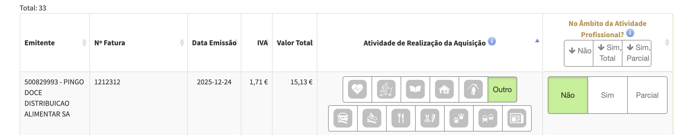

#  Как и зачем размечать траты по категориям

## Что это и зачем

На разные категории трат есть налоговые вычеты. 

А для дохода категории B и в зависимости от предпринимательской деятельности (IT услуги типа разработки подходят, но надо проверять), налогооблагаемая база от дохода — 75%. Остальные 25% считаются вашими тратами на эту деятельность, 15 из которых нужно доказать счетами. 

Взносы в Segurança Social учитываются для "набора" этих 15%, и не размечаются вручную, как описано ниже.

## Полезные ссылки
- https://faturas.portaldasfinancas.gov.pt/consultarDocumentosAdquirente.action тут можно посмотреть все свои счета/чеки, где вы указывали NIF
- https://faturas.portaldasfinancas.gov.pt/resolverListaPendenciasAdquirenteForm.action тут можно разметить по категориям счета, которые еще не размечены

## Как разметить траты
Удобнее и точнее это упражнение делать раз в месяц/квартал, чем раз в год

1. https://faturas.portaldasfinancas.gov.pt/resolverListaPendenciasAdquirenteForm.action открываем страницу
2. снизу страницы находим `registos por página` и выбираем максимальное значение, чтобы видеть максимум счетов за раз
3. у каждой строки таблицы выбираем `Atividade de Realização da Aquisição` и `No Âmbito da Atividade Profissional?`

   *  При каждом выборе вас спросят `Pretende remover o mesmo âmbito..` / `Pretende remover o mesmo setor..` - хотите ли выбрать то же самое для всех остальных счетов от той же организации 
   * `Atividade de Realização da Aquisição` - категория или тип счета. По их иконкам +- понятно о чем речь, но:
     * `Saude` - Здоровье: враче, аптеки и прочее
     * `Ginásios` - Спортзалы и секции
     * `Educação` - Образование, репетиторы, кружки и тп
     * `Imóveis` - Недвижимость
     * `Lares` - Дома престарелых
     * `Outros` - Всё остальное
     * `Manutenção e reparação de veículos automóveis` - ремонт/обслуживание авто
     * `Manutenção e reparação de motociclos, de suas peças e acessórios`  - ремонт/обслуживание мото
     * `Alojamento, restauração e similares` - рестораны / отели
     * `Atividades de salões de cabeleireiro e institutos de beleza` - Парикмахерские / салоны красоты
     * `Atividades veterinárias` - ветеринария 
     * `Aquisição de passes mensais ou de bilhetes para utilização de transportes públicos coletivos` - общественный транспорт
     * `Jornais e Revistas` - газеты и журналы
   * `No Âmbito da Atividade Profissional?` - этот счет в рамках вашей проф деятельности или нет. `Não` (нет) / `Sim` (да) / `Parcial` (частично, например счет за интернет, если вы работаете из дома)
4. Нажимаем `Guardar` (сохранить), проверяем остались ли на странице еще счета или ошибки
   * Ошибки: `O emitente não tem atividade registada (CAE/CIRS) pertencente ao setor indicado.` - означает, что вы выбрали не ту категорию для траты. У эмитента нет регистрации деятельности в такой категории 

## Как добавить счет, если не был указан NIF

< todo >